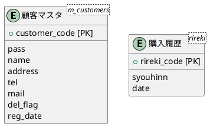

```puml
@startuml
entity "顧客マスタ" as customer <m_customers> {
+ customer_code [PK]
--
pass
name
address
tel
mail
del_flag
reg_date
}
entity "購入履歴" as rireki <rireki> {
+ rireki_code [PK]
--
syouhinn
date
}
@enduml
```
