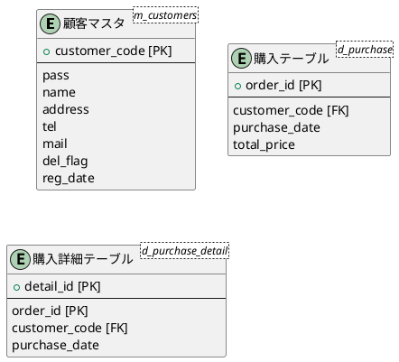

```puml
@startuml
entity "顧客マスタ" as customer <m_customers> {
+ customer_code [PK]
--
pass
name
address
tel
mail
del_flag
reg_date
}

entity "購入テーブル" as purchase <d_purchase> {
+ order_id [PK]
--
customer_code [FK]
purchase_date
total_price
}

entity "購入詳細テーブル" as purcher_detail <d_purchase_detail> {
+ detail_id [PK]
--
order_id [PK]
customer_code [FK]
purchase_date
}
@enduml
```
