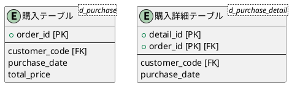

```puml
@startuml
entity "購入テーブル" as purchase <d_purchase> {
+ order_id [PK]
--
customer_code [FK]
purchase_date
total_price
}

entity "購入詳細テーブル" as purcher_detail <d_purchase_detail> {
+ detail_id [PK]
+ order_id [PK] [FK]
--
customer_code [FK]
purchase_date
}
@enduml
```
