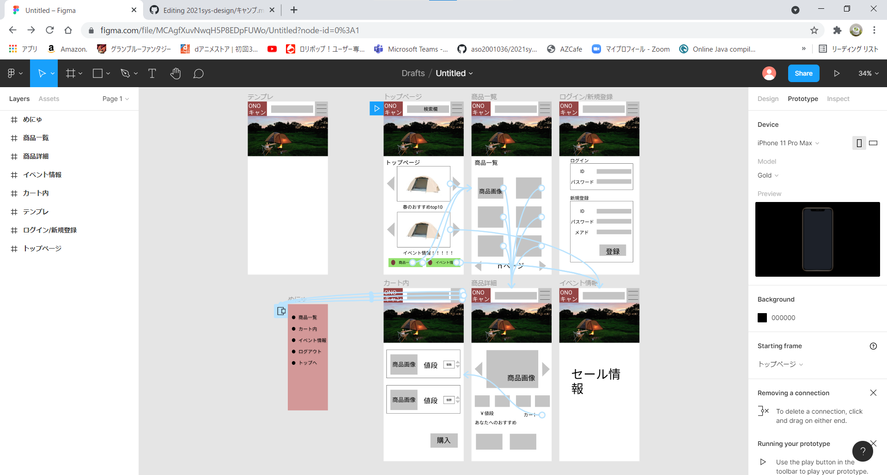

### 画面詳細図
## トップページ
### プロトタイプは以下のリンク先
[プロトタイプ](https://www.figma.com/file/MCAgfXuvNwqH5P8EDpFUWo/Untitled?node-id=0%3A1)
******

******
補足：対応DBの列はDB設計後、〇を対応するテーブル・カラムに差し替えること。

| ID | 要素 | 内容 | アクション | イベント |　たいおうDB |
|----|------|------|------------|---------|--------------|
|1|トップページ|画面|クリック|画面遷移|〇|
|2|商品一覧|画面|クリック|画面遷移|〇|
|3|商品詳細|画面|クリック|画面遷移|〇|
|4|カート内|画面|クリック|画面遷移|〇|
|5|イベント情報|画面|クリック|画面遷移|〇|
|6|ログイン|画面|クリック|画面遷移|〇|
|7|新規登録|画面|クリック|画面遷移|〇|

